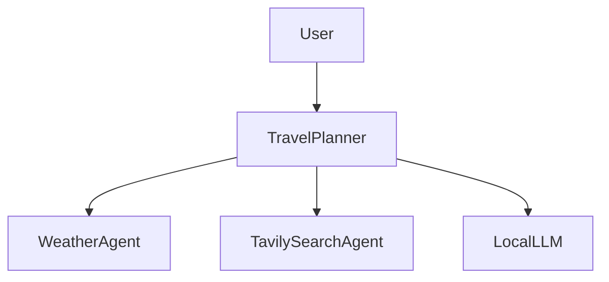

# 📍 Travel Planner – AI Agent System

This project is a multi-agent Travel Planner powered by the **A2A (Agent-to-Agent)** protocol. It uses LangChain, Ollama LLM, and multiple A2A-compatible agents to collaboratively fetch weather data, search results, and generate a final travel recommendation.

---

### 🚀 Features

* 🌦️ **WeatherAgent** – Provides weather info for the destination.
* 🔍 **TavilySearchAgent** – Searches the web for relevant information.
* 🤖 **LocalLLM** – Hosts a local LLM (`llama3.2`) using `langchain_ollama`.
* 🧠 **TravelPlanner** – Coordinates the above agents using the A2A protocol.

---

### 🧩 Architecture



---

### 📁 Directory Structure

```
travel-planner/
│
├── .env                        # Environment variables
├── WeatherAgent.py             # Weather API Agent (A2A)
├── TavilySearchAgent.py        # Search Agent using Tavily (A2A)
├── LocalLLM.py                 # Local LLM server using Ollama + LangChain
├── Travel_Planner_Agent.py     # Main Planner Agent
├── TravelPlannerApp.py         # Main Streamlit  App
├── main.py                     # Runs agents sequentially with delay
└── README.md                   # This file
```

---

### ⚙️ Setup

#### 1. 📦 Install Dependencies

```bash
uv venv
.venv\Scripts\activate
uv sync
```

#### 2. 🧪 Configure `.env`

Ensure you have the following keys in your `.env` file:

```dotenv
OPENWEATHER_API_KEY=your_weather_key
TAVILY_API_KEY=your_tavily_key
```

#### 3. 🏃‍♂️ Run All Agents

```bash
uv run main.py
```

This script launches all agents one by one with a 2-second delay.

---

### 🛠 Tech Stack

* 🧠 `LangChain` + `Ollama`
* 🔄 `python_a2a` (Agent-to-Agent protocol)
* 🌐 `FastAPI` under the hood
* ⛅ Weather & Search APIs

---

### 📝 Notes

* All agents expose A2A-compatible APIs.
* The servers **must run concurrently** for A2A to function properly.
* Best used with `llama3.2` loaded in your Ollama setup.